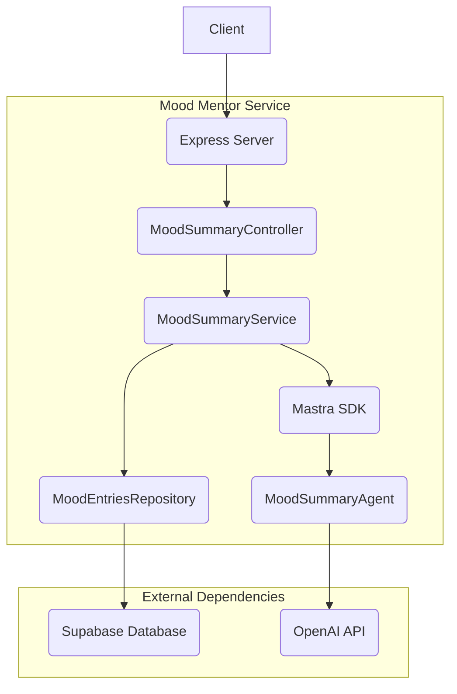
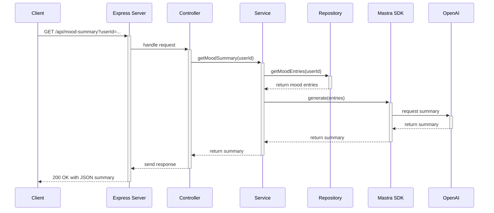

# Mood Mentor

Mood Mentor is a web service that provides mood summaries based on user mood entries. It uses a combination of Express.js, TypeScript, and Supabase for the backend, with the Mastra library for AI-powered mood analysis.

## Architecture

The application follows a layered architecture, with a clear separation of concerns between controllers, services, and repositories.



**Data Flow:**



## Getting Started

### Prerequisites

- Node.js
- npm
- A Supabase account and project

### Installation

1.  Clone the repository:
    ```bash
    git clone https://github.com/your-username/mood-mentor.git
    ```
2.  Install the dependencies:
    ```bash
    npm install
    ```
3.  Create a `.env` file in the root directory and add your Supabase credentials:
    ```
    SUPABASE_URL=your-supabase-url
    SUPABASE_KEY=your-supabase-key
    OPENAI_API_KEY=your-openai-api-key
    ```

### Running the Application

To start the development server, run:

```bash
npm run start:dev
```

The server will be running on `http://localhost:3000`.

## API Endpoints

- `GET /api/mood-summary?userId=<user-id>`: Get a mood summary for a specific user.

## Project Structure

```
src/
├── App.ts                  # Express application setup
├── index.ts                # Application entry point
├── config/
│   └── default.ts          # Application configuration
├── controllers/
│   └── MoodSummaryController.ts # API endpoint for mood summaries
├── exceptions/             # Custom exception classes
├── lib/                    # Utility functions and libraries
├── mastra/                 # Mastra AI integration
├── middlewares/            # Express middlewares
├── repos/
│   └── MoodEntriesRepository.ts # Data access layer for mood entries
├── services/
│   └── MoodSummaryService.ts  # Business logic for mood summaries
└── types/                  # TypeScript type definitions
```
